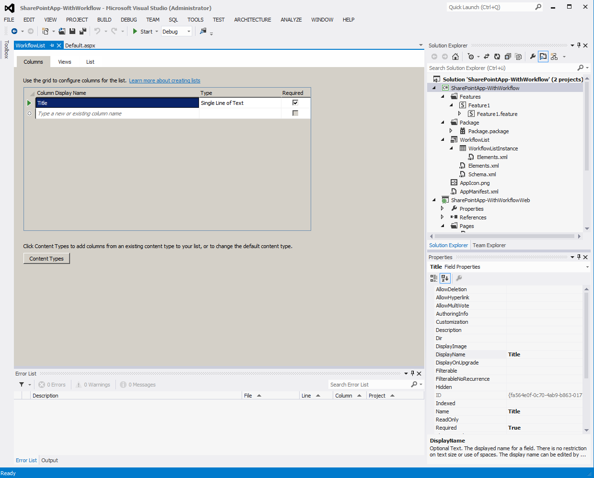
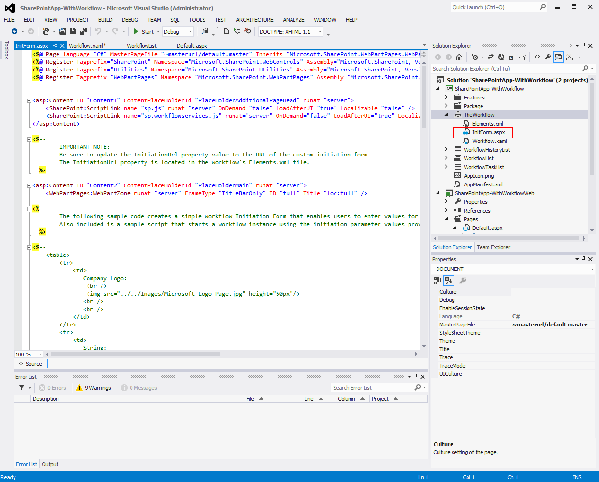
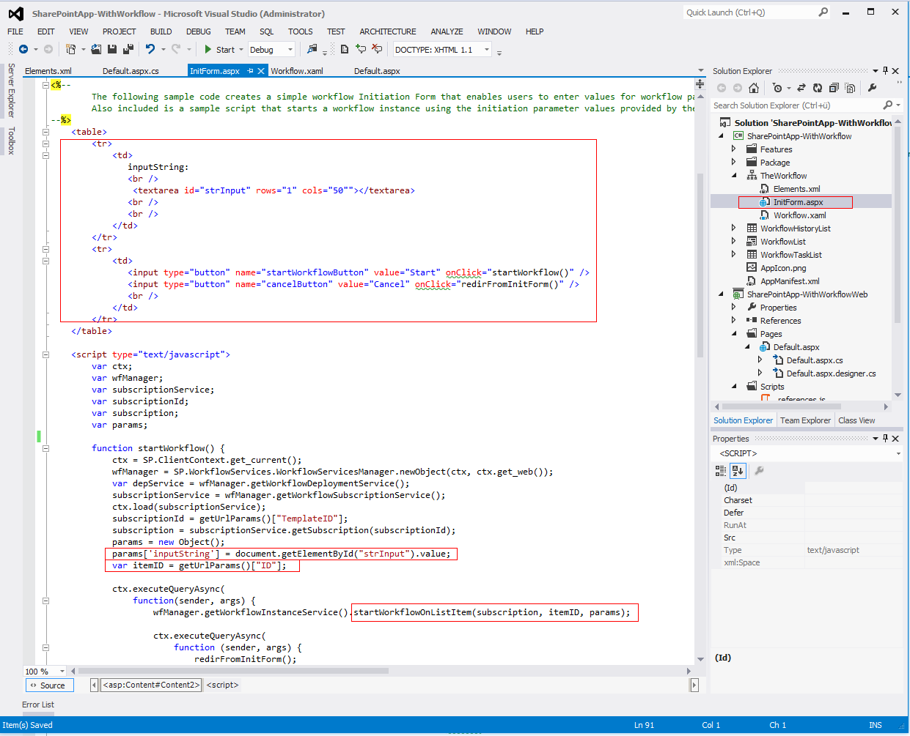
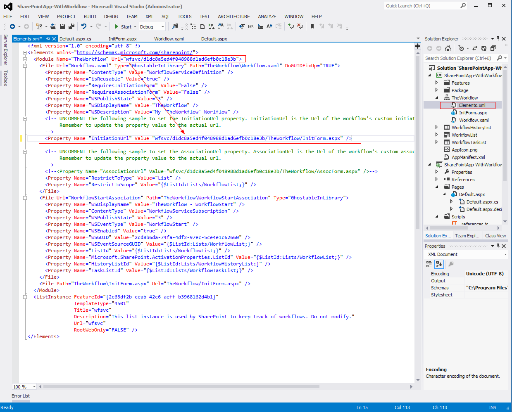

# Prerequisites

Create a on-prem high trust app as described in my previous blog post.
# Add the Workflow

First of all we need to add a list to host the workflow by adding a new item of type “List” to the SharePoint AppWeb project.

In a further step, the list could be configured using the new list designer in Visual Studio 2012.

Now that we have a list, we can add a workflow to be run on that list by adding a new Item of type “Workflow”to the SharePoint AppWeb project. Set the workflow to start manually and associate it with the previously created list. Select the according items to create a Workflow History And Workflow Tasks List for the Workflow.

The new Workflow Designer should now be visible showing a workflow with an empty sequence.

The custom initiation form will just contain a single string. In order to use that string within the workflow a variable has to be added as input parameter, e.g. “inputString”. To show that the value is actually submitted to the workflow we use a “WriteToLog” Activity that writes the value of our input parameter to the Workflow History List.

The next step is to add a custom Initiation Form by adding a new Item of Type “InitiatonForm” to the Workflow element. This adds a default InitiationForm to the project which is already populated with some code.

Clean up the form to only contain a single text field for our string input variable. In the “startWorkflow” function triggered by the submit button the value of the text field must be added to the params object. It is also necessary to get the List Item ID from the URL, since this is needed as parameter for the “startWorkflowOnListItem” method on the “WorkflowInstance” object.

The last step is to add a reference to the custom initiation form in the Elements deklaration of the workflow element.

The interesting part here is, that the URL Token replacement does not seem to work properly here as I posted in Apps for SharePoint [MSDN forum](https://social.msdn.microsoft.com/Forums/en-US/d23338c8-255e-4945-8a13-8bcdf0d6e167/2013-workflow-initiation-form-in-remoteappurl?forum=appsforsharepoint). This means that custom initiation and association forms can only be created in the AppWeb and not in the Remote App, which makes more complicated scenarios pretty much bound to javascript/html implementations for now.

After a deploy the ListItem has a workflow associated to it and after starting it manually, the user gets our custom initiation form presented.

After the workflow is completed, the workflow history log shows the value entered in  the initiation form.

[2013 Workflow Initiation Form in ~remoteAppUrl](https://social.msdn.microsoft.com/Forums/en-US/d23338c8-255e-4945-8a13-8bcdf0d6e167/2013-workflow-initiation-form-in-remoteappurl?forum=appsforsharepoint)