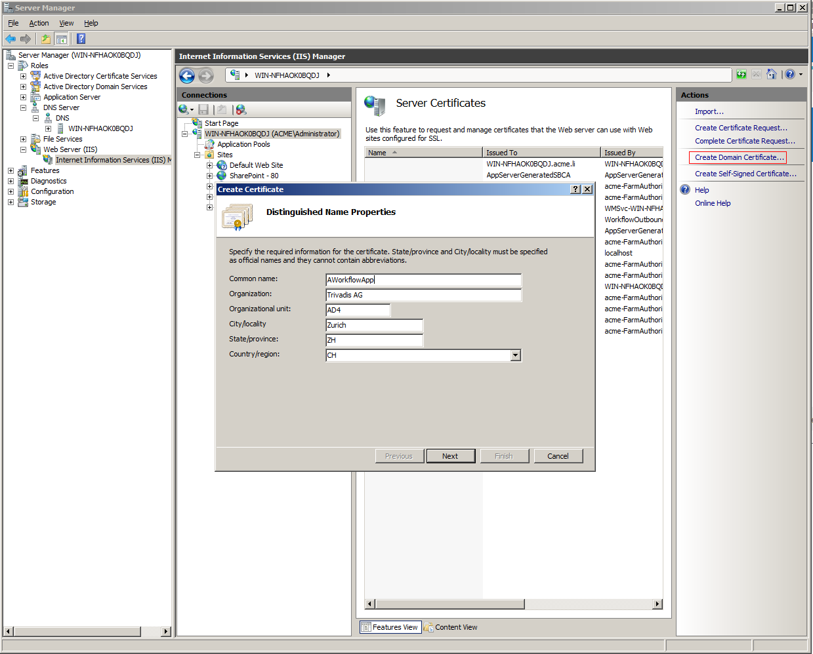
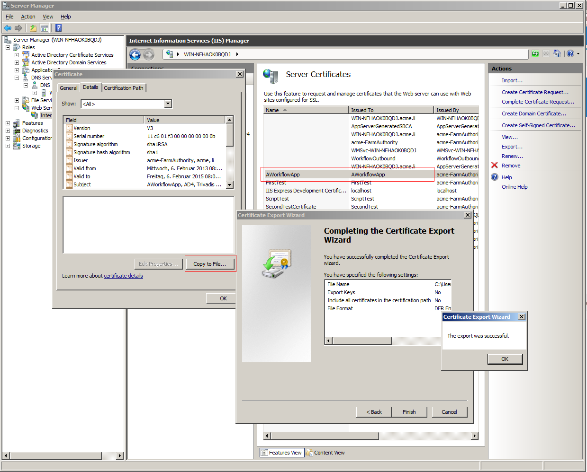
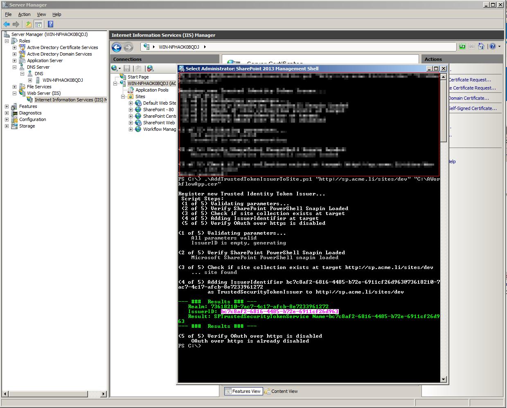
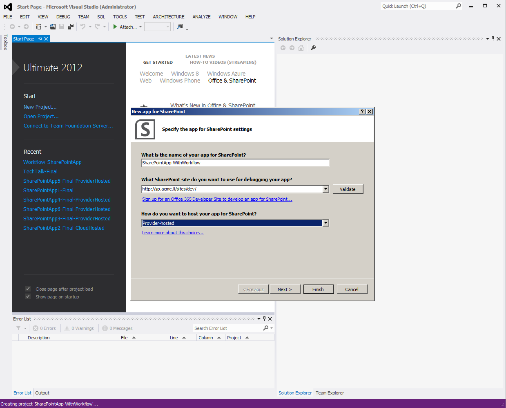
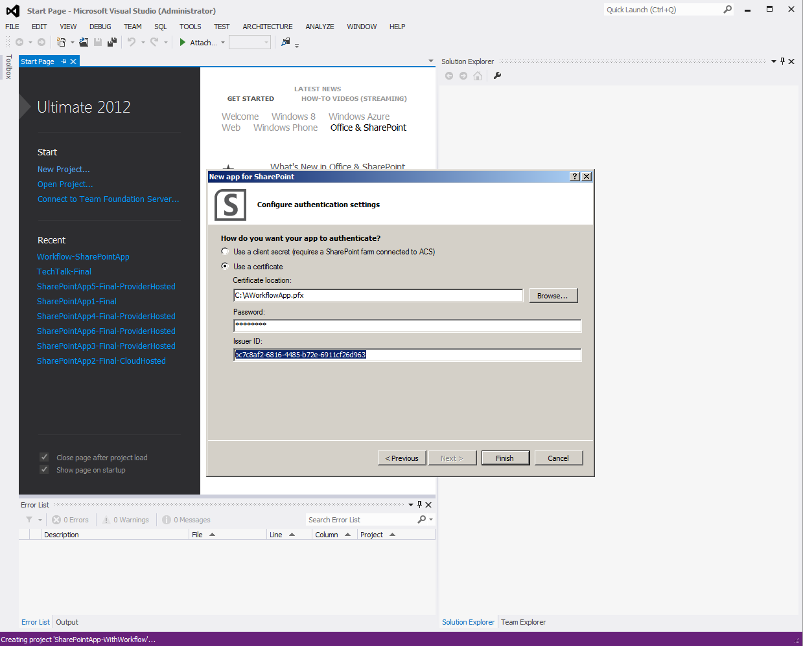
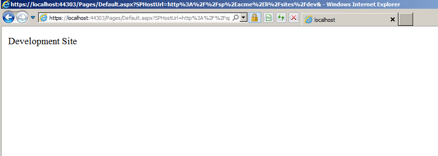

# Prerequisites

First of all a on-prem development environment has to be created. I used the [How to: Set up an on-premises development environment for apps for SharePoint](https://docs.microsoft.com/en-us/sharepoint/dev/sp-add-ins/set-up-an-on-premises-development-environment-for-sharepoint-add-ins?redirectedfrom=MSDN) found in MSDN.

# High Trust App

In order to create an on-prem app, the app must be registered in SharePoint as “trusted token issuer”. There are currently two different procedures depending on the version of Office Developer Tools for Visual Studio 2012. The respective procedures by using self-signed certificates is described in [How to: Create high-trust apps for SharePoint 2013 using the server-to-server protocol (advanced topic)](https://docs.microsoft.com/en-us/sharepoint/dev/sp-add-ins/create-high-trust-sharepoint-add-ins?redirectedfrom=MSDN).

I am using Active Directory Certificate services my development environment, so I am able to create certificate with my own trusted Root Authority in the IIS configuration UI by clicking “Create Domain Certificate”.

After creating the certificate, both the public (.cer) and the private (.pfx) key have to be exported. The .cer file is exported by opening the certificate and hitting “Copy to file” on the “Details” tab. Use the default settings in the dialog.

The .pfx file can be exported by clicking the “Export” in the Actions sidebar. Don’t forget to set a password, since it is needed later when creating the Visual Studio project.

The next step is to register the App as trusted token issuer, I streamlined this process in a [PowerShell](add-new-trusted-token-issuer-to-a-sharepoint-2013-site-s2s-hightrust-apps) script for the Preview 2 Version of the Office Developer Tools for Visual Studio 2012. The first parameter of the script denotes the site, where the app will be deployed to and the second parameter points to the public key (.cer) file.

The result shows a new IssuerID which is used to identify the app. The IssuerID has to be entered when creating the Visual Studio Project.

After creating a new App for SharePoint 2013 Project, select Provider-Hosted as hosting option. Enter a name and the site url used before and hit next.

Select “Use a certificate” for authentication and select the private key (.pfx) file, enter the IssuerID created by the PowerShell script before and the password for the private key file.

Hit F5 if you get a page showing the Title of the HostWeb everythings OK 🙂

