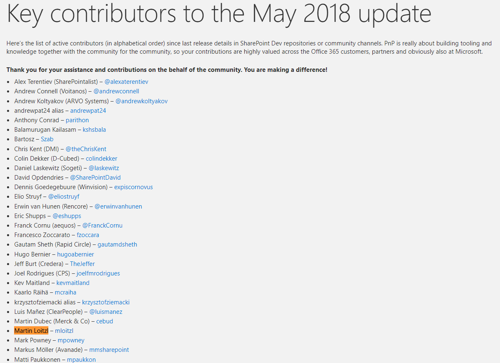

Only a few lines of code, but at the end I felt thrilled that I could contribute to the [OfficeDevPnp](https://github.com/pnp) project.

The steps are quite simple:

- Fork the repo
- Create your local dev environment
- Implement your feature
- Read the [Contribution Guide](https://github.com/pnp/PnP-PowerShell/blob/master/CONTRIBUTING.md)
- Fill out the [paperwork](https://github.com/pnp/PnP-PowerShell/pull/1457)
- Open an [upstream Pull Request](https://docs.github.com/en/github/collaborating-with-issues-and-pull-requests/creating-a-pull-request-from-a-fork)
- And probably get it merged

- And the end you also get some kudos in the [community blog](https://developer.microsoft.com/en-us/office/blogs/sharepoint-development-community-pnp-may-2018-update/)

> Thank you for your assistance and contributions on the behalf of the community. You are making a difference!

You're welcome! 😁