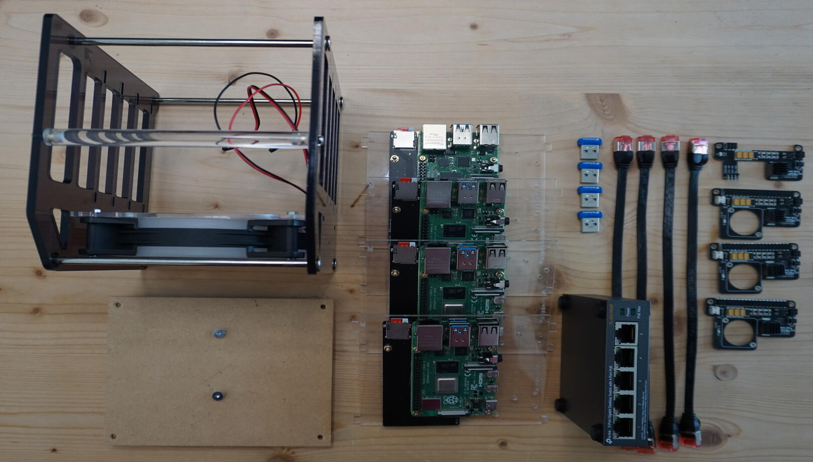
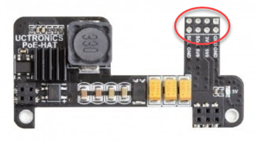
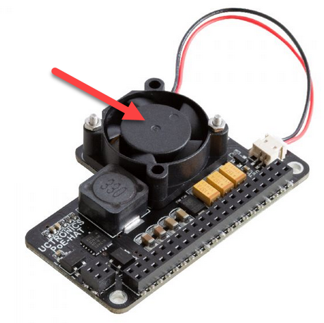

Since literally everbody I know is currently working on a cloud@home project in some form I also decided to start working a long planned project: a portable kubernetes cluster. 

And also a former [colleague](https://sandrofelder.ch/building-your-own-private-cloud-with-raspberry-pi-4-and-kubernetes/) gave me the last push for it - thanks 😉

# Portability

Currently, portability means, that only 2 cables - power and network - are connected.

A later addition I am planning is attaching the cluster to a mobile router. The question ist, if the POE switch can deliver the necessary additional power for this.

And, the 52Pi rack tower has a handle to carry it around - or throw it out of the window - depends on the use case.

This will become a series of articles, lets start with the hardware.

# Hardware

## Parts List

| # | Part | each |
|:-:|:-----------------------------------------|-----:|
|4 | [Raspberry Pi 4 8GB Model B  (ARMv8)](https://www.raspberrypi.org/products/raspberry-pi-4-model-b/) | CHF 89.90 |
|4 | [Verbatim Nano 64GB USB Sticks](https://www.verbatim.de/de/prod/verbatim-store-n-stay-nano-usb-32-gen-1-drive-64gb-98711/) | CHF 11.95 | 
|1 | [52Pi ZP-0088 Rack Tower](https://wiki.52pi.com/index.php/Rack_Tower_SKU:_ZP-0088) | CHF 35.00 |
|1 | [POE Switch Tp-Link TL-SG1005P](https://www.tp-link.com/us/business-networking/poe-switch/tl-sg1005p/) | CHF 51.30 |
|4 | [POE Cables LogiLink (U/FTP, Kat. 6a, 25cm)](http://www.logilink.de/content/support/kataloge.htm) | CHF 5.90 |
|3 | [POE Hat Type U6109](https://www.uctronics.com/tools-and-accessories/pi-accessories/poe-hat-for-raspberry-pi-4-uctronics-mini-power-over-ethernet-expansion-board-for-raspberry-pi-4-b-3-b.html) | CHF 23.90 |
|1 | [POE Hat Type U6110](https://www.uctronics.com/poe-hat-for-raspberry-pi-4-uctronics-mini-power-over-ethernet-expansion-board-for-raspberry-pi-4-b-3-b-with-cooling-fan.html) | CHF 25.90 |
|1 | [Dupont Pin Row](https://www.aliexpress.com/w/wholesale-dupont-connector-pin.html) | CHF 0.05 |
|  | Total          | **CHF 614.95** |

## Dupont Pins on the U6109

The [U6109](https://www.uctronics.com/tools-and-accessories/pi-accessories/poe-hat-for-raspberry-pi-4-uctronics-mini-power-over-ethernet-expansion-board-for-raspberry-pi-4-b-3-b.html) actually has two rows for connectors, mine had no connectors soldered in - unfortunately.

My soldering skills are a little dated, but I took my chances - and it worked out nicely.

Fan and LED connector cables can now easily be attached to the POE powered Raspberry.

Speaking of ventilation: the 52Pi rack tower ventilator is suprisingly quiet, but powerfull - so having it in the same room is not disturbing at all.

I removed the fan from the [U6110](https://www.uctronics.com/poe-hat-for-raspberry-pi-4-uctronics-mini-power-over-ethernet-expansion-board-for-raspberry-pi-4-b-3-b-with-cooling-fan.html), because they make a quite annoying sound.

## Accessible SD Cards

A quite handy feature of the 52Pi rack tower are the SD card adapters. The card slots would be very hard to reach, when the case is fully assembled.

## Mount the POE Switch

A simple wooden plate with a bunch of holes is connected to the base of the 52Pi rack tower using 4 blue cable ties.

The 2 Screws in the middle are connected the wall-mount recess of the POE Switch.

An acrylic plate would be nice, but I don't have access to a laser-cutter.

## Fully assembled

The fully assembled case with the 4 USB Sticks for the [Storage Cluster](setting-up-a-four-times-redundant-gluster-with-mini-usb-sticks).

Looks quite shiny by night 🤓

# Related

- [Portable Kubernetes Cluster based on Raspberry Pi 4 and Rancher K3S](/posts/portable-kubernetes-cluster-Raspberry4-rancher-k3s/) (this)
- [Setup mini Kubernetes Rancher K3S on Raspberry OS Lite](/posts/setup-k3s-on-raspberryos-lite/)
- Storage class and nfs provisioner
- [Setting up a four times redundant gluster volume with mini USB sticks](/posts/setting-up-a-four-times-redundant-gluster-with-mini-usb-sticks/)
- Automatically provision Gluster volumes with Heketi