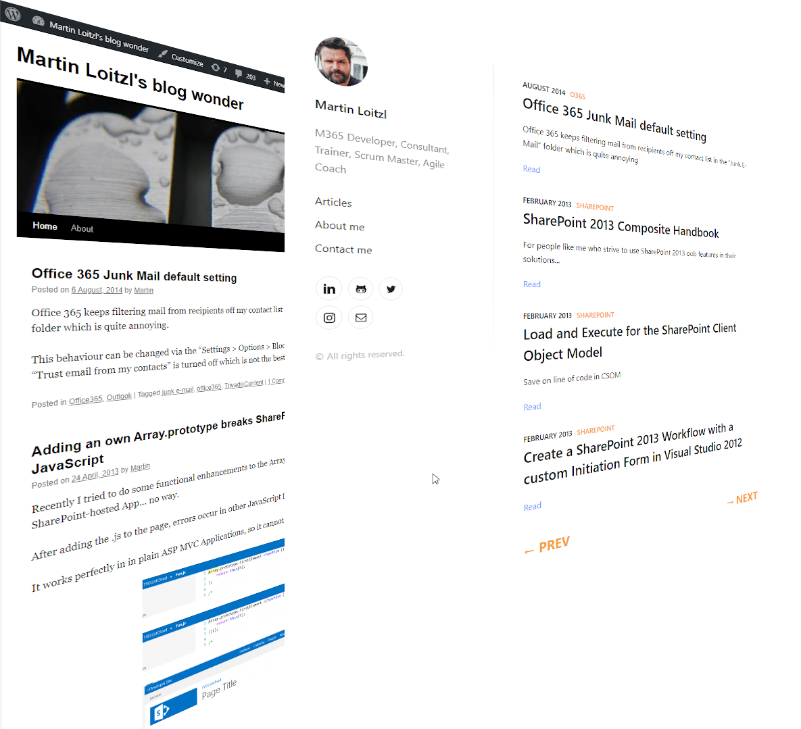
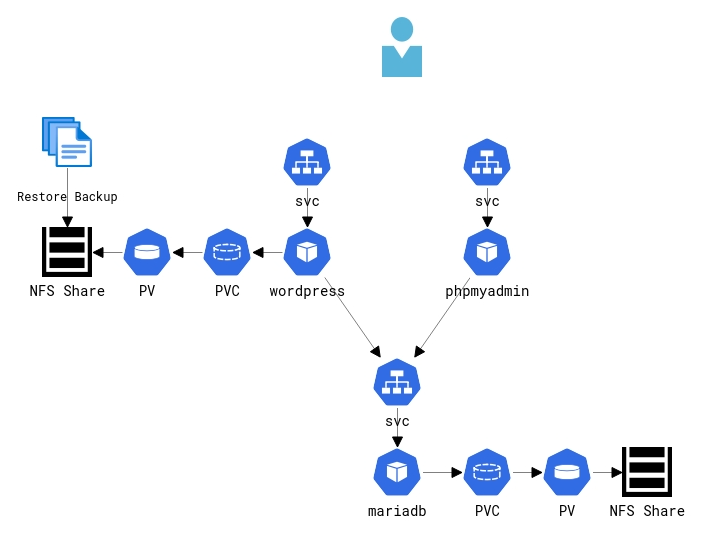

# You've been busted!

Due to poorly developed plugins, Wordpress blogs are prone to hacking.

Luckily I wasn't using any of those most dangerous Wordpress plugins mentioned in [this article](https://wordpressforgood.com/most-dangerous-wordpress-plugins/), but just like many others, my weblog got abused for cross-site-request-forgeries and phishing - using php files that have been uploaded years before through exploits.

At the end my account got locked and I lost interest a little.

***

But, I still had some old backups.

On my beloved [homegrown k8s cluster](/posts/setup-k3s-on-raspberryos-lite/) I was able to fire up some old [php](https://github.com/mloitzl/oldblogrestore/blob/master/wordpress-deployment.yml) containers, a new [mariadb](https://github.com/mloitzl/oldblogrestore/blob/master/mariadb-deployment.yml) and [phpmyadmin](https://github.com/mloitzl/oldblogrestore/blob/master/phpmyadmin-deployment.yml).



<sub>[CloudSkew](https://app.cloudskew.com/viewer/f630bdcc-6dca-46cd-9168-9e9b762ad2dc)</sub>


I restored the backup files into the persistent volume, imported the SQL dumps to mariadb, some more tweaks and we are ready to go.


```bash
$ kustomize edit set namespace old-blog
$ kustomize build | kubectl apply -f -

$ kubectl run -i --rm --image=arm64v8/mariadb:10.5 --restart=Never mariadb-client -- mysql -h mariadb -ppassword -e "create database wordpressdb"
$ kubectl run -i --rm --image=arm64v8/mariadb:10.5 --restart=Never mariadb-client -- mysql -h mariadb -ppassword wordpressdb < wordpressdb.sql

$ kubectl run -i --rm --image=arm64v8/mariadb:10.5 --restart=Never mariadb-client -- mysql -h mariadb -ppassword -e "create database gallery2db"
$ kubectl run -i --rm --image=arm64v8/mariadb:10.5 --restart=Never mariadb-client -- mysql -h mariadb -ppassword gallery2db < loitzlco-gallery2.sql

```

Comes in quite quite handy for (manually) migrating and updating (dead links, etc.) to my new statically generated [Lumen](https://github.com/mloitzl/lumen).


