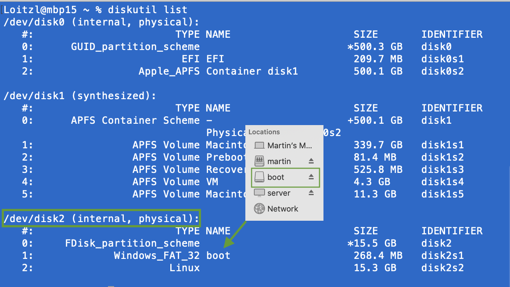

After finishing the [hardware](portable-kubernetes-cluster-Raspberry4-rancher-k3s) part of the cluster, let's see how to setup Kubernetes.

# Versions

> Raspberry Pi OS Lite 2020-08-20 
> [Release Notes](https://downloads.raspberrypi.org/raspios_lite_armhf/release_notes.txt)

> Rancher K3S 1.20.0
> [Product Page](https://rancher.com/products/k3s/)


# Create the SD Cards

List the partitions in MacOS Terminal using `diskutil list`.

```bash
$ diskutil list
```



Be really really (really!) sure, that you take the right volume. It also helps if its named properly in Finder.

In this case it has the number **2**.

Lets unmount it:

```bash
$ diskutil unmountDisk /dev/disk2
```

Now lets go to the **danger zone**. `dd` the downloaded `img` file to the SD Card device.

Be sure that you get the right volume number `/dev/rdisk->2<-`. Using /dev/**r**disk instead /dev/disk just makes the process a little faster.


```bash
$ sudo dd if=2020-08-20-raspios-buster-arm64-lite.img of=/dev/rdisk2 bs=8m
```

***

The output of `dd` is quite reduced, can make one nervous...
- ... on MacOS hit Ctrl+T to get some information about the progress.
- ... on most Linux distros there should be a command line option `status=progress`.

```bash
$ dd if=/dev/urandom of=/dev/null count=131072 bs=1024 status=progress
129695744 bytes (130 MB, 124 MiB) copied, 4 s, 32.4 MB/s # progress
131072+0 records in  # records read
131072+0 records out # records written
134217728 bytes (134 MB, 128 MiB) copied, 4.13999 s, 32.4 MB/s  # totals, duration and speed
```

<sub>https://askubuntu.com/questions/215505/how-do-you-monitor-the-progress-of-dd</sub>
<sub>https://www.raspberrypi.org/documentation/installation/installing-images/mac.md</dub>

 ***

Before pulling the SD Card out of the slot, we can already set some necessary boot options for running Kubernetes:

- enable [cgroups](https://01.org/linuxgraphics/gfx-docs/drm/admin-guide/cgroup-v1/cgroups.html)

```bash
# Assuming that the new card has a boot partition that is mounted under /Volumes/boot
$ echo -n "cgroup_enable=cpuset cgroup_enable=memory cgroup_memory=1" >> /Volumes/boot/cmdline.txt
```

And let's enable `ssh` since we are in a headless mode:


```bash
# Assuming that the new card has a boot partition that is mounted under /Volumes/boot
$ touch /Volumes/boot/ssh
```


# First boot

Put the cards into the Pis and start them up with the Ethernet cables connected.

Find a way to determine the IP addresses, for example by logging into your router Web UI. Or if you like the more Linux way using [`arp`](https://www.dnsstuff.com/ip-network-scanners) commands:


>> **Immediately change the password!**

The default password currently is "raspberry" - by the way.

```bash
$ ssh pi@192.168.1.x
$ passwd
```

Update the Pis

```bash
$ sudo rpi-update
$ sudo reboot
```

# K3S first contact

Now we can check if the host OS is any good for running Rancher K3S.


```bash
$ curl -sfL https://raw.githubusercontent.com/rancher/k3s/master/contrib/util/check-config.sh | sh -

```

In my case it complained about, that [iptables is too new](https://github.com/kubernetes/kubernetes/issues/71305#issuecomment-479558920).
Raspberry OS has a simple way to fix this:


```bash
$ update-alternatives --set iptables /usr/sbin/iptables-legacy
```


# Install K3S

The actual setup is unbelievably easy, just run:

## Master Node

```bash
$ sudo curl -sfL https://get.k3s.io | sh -
``` 

## Worker Nodes

Get the node token on the master node

```bash
$ sudo cat /var/lib/rancher/k3s/server/node-token
```

Run this command with the ip of the master node and the `node-token` from above command.

```bash
$ curl -sfL http://get.k3s.io | K3S_URL=https://<MASTER NODE IP>:6443 \
                      K3S_TOKEN=<NODE TOKEN> sh -
```

Done!

Don't believe it?

```bash
$ sudo kubectl get nodes
NAME                 STATUS   ROLES                  AGE    VERSION
barbarachristensen   Ready    control-plane,master   4m4s   v1.20.0+k3s2
janerose             Ready    <none>                 4m4s   v1.20.0+k3s2
maryireland          Ready    <none>                 4m4s   v1.20.0+k3s2
dianabeverley        Ready    <none>                 4m4s   v1.20.0+k3s2
```


<center>😎</center>

# Convenience Features

## Non-root access

Enable [non-root access](https://rancher.com/docs/k3s/latest/en/cluster-access/) to kubectl:
```bash
$ cat /etc/rancher/k3s/k3s.yaml > ~/.kube/config
```

## Bash auto completion

Enable [bash auto completion](https://kubernetes.io/docs/tasks/tools/install-kubectl/#enabling-shell-autocompletion): 

<sub>The link contains also information for other OSes.</sub>

```bash
$ sudo apt-get install bash-completion
$ echo 'source <(kubectl completion bash)' >>~/.bashrc
$ echo 'alias k=kubectl' >>~/.bashrc
$ echo 'complete -F __start_kubectl k' >>~/.bashrc
```


## Shutdown remotely

```bash
#!/bin/sh
for i in `cat nodes.lst`;
	do /usr/bin/ssh -t $i /usr/bin/sudo /sbin/poweroff;
done
```

```bash
$ cat nodes.lst
192.168.1.60
192.168.1.61
192.168.1.62
192.168.1.63
```

To avoid entering a password for each node, copy the ssh key to each node:

```bash
$ for i in `cat nodes.lst`;do /usr/bin/ssh-copy-id $i;done
```

<sub>from: https://www.simplylinuxfaq.com/2015/02/how-to-shutdown-remote-system-via-ssh-without-password.html</sub>


After getting passwordless authentication to work it might be a good idea to [password authentication completely](https://www.cyberciti.biz/faq/how-to-disable-ssh-password-login-on-linux/).


# Related

- [Portable Kubernetes Cluster based on Raspberry Pi 4 and Rancher K3S](/posts/portable-kubernetes-cluster-Raspberry4-rancher-k3s/)
- [Setup mini Kubernetes Rancher K3S on Raspberry OS Lite](/posts/setup-k3s-on-raspberryos-lite/) (this)
- Storage class and nfs provisioner
- [Setting up a four times redundant gluster volume with mini USB sticks](/posts/setting-up-a-four-times-redundant-gluster-with-mini-usb-sticks/)
- Automatically provision Gluster volumes with Heketi