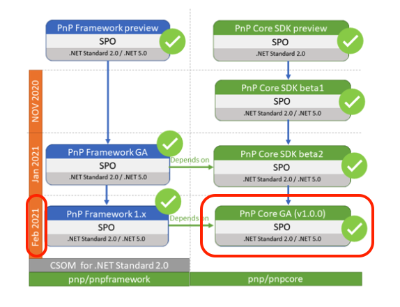
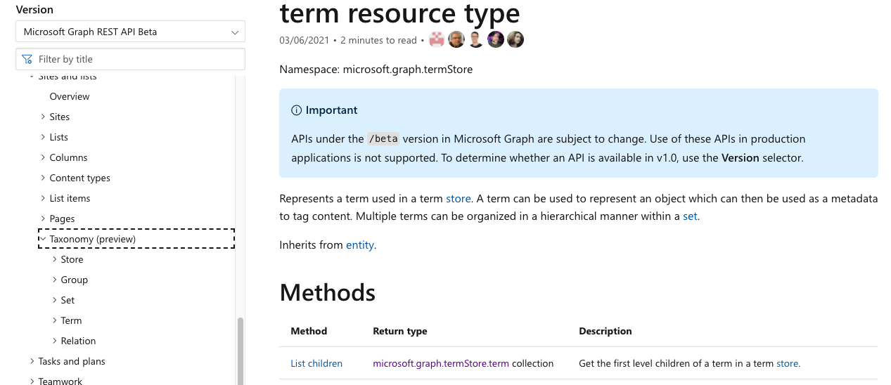
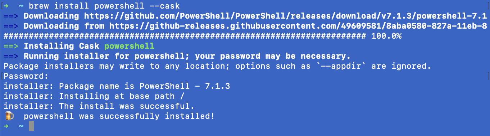
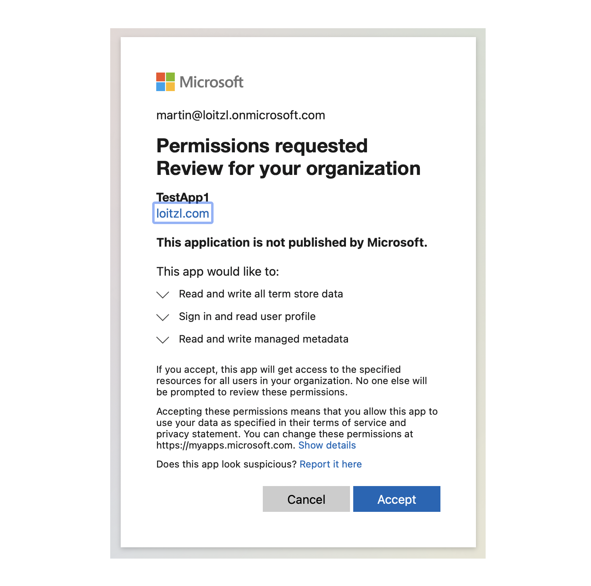
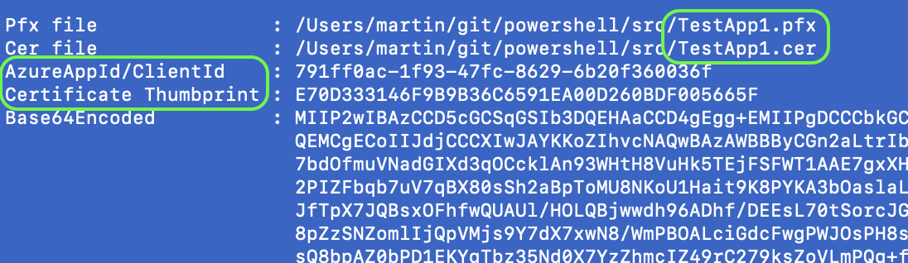
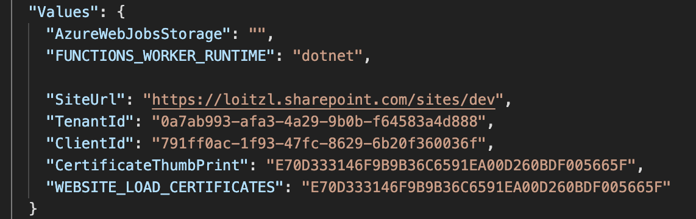
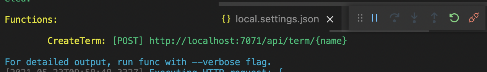
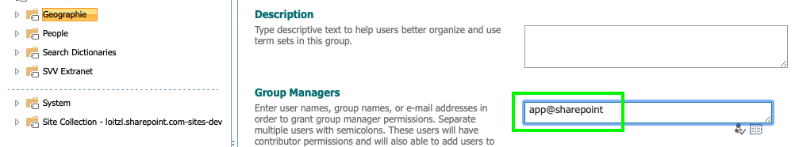

# Introduction

Lately I had the chance to work with the new [PnP Core SDK](https://pnp.github.io/pnpcore/).

Its running under dot net core, which is an awesome improvement compared to the older [PnP Sites Core](https://github.com/pnp/PnP-Sites-Core) which I used a lot in the past couple of years ❤️




The methods for accessing the termstore leverage the [new taxonomy endpoint](https://docs.microsoft.com/en-us/graph/api/termstore-term-post?view=graph-rest-beta&tabs=http) of MS Graph beta endpoint.



The article shows 
- the setup of an Azure AD App using the PnP Powershell Module and 
- an Azure Function accessing the Term Store using client certificate authentication.

# Setup Authentication

Setting up the Azure AD App for this is straight forward using the [`Register-PnPAzureADApp`](https://pnp.github.io/powershell/cmdlets/Register-PnPAzureADApp.html) PowerShell commandlet.

Im am doing this with macOS Big Sur, so first we have to [install PowerShell](https://docs.microsoft.com/en-us/powershell/scripting/install/installing-powershell-core-on-macos?view=powershell-7.1):

```bash
$ brew install --cask powershell
````



That seemed to work, no lets start PowerShell.

```bash
$ pwsh
```

Install the [PnP PowerShell Module](https://pnp.github.io/powershell/)

```powershell
Install-Module -Name "PnP.PowerShell"

Untrusted repository
You are installing the modules from an untrusted repository. If you trust this repository, change its InstallationPolicy value by running the Set-PSRepository cmdlet. Are you sure you want to install the modules from 'PSGallery'?
[Y] Yes  [A] Yes to All  [N] No  [L] No to All  [S] Suspend  [?] Help (default is "N"): y
```

The App can be created and trusted in Azure Active Directory using the `Register-PnPAzureADApp` PnP commandlet. This commandlet can also create a self-signed certificate out of the box, but this only works on Windows machines.

On Linux/Mac based system we can provide our own certificate using the following `openssl` commands:

```bash{numberLines: true}
# Create the certificate
$ openssl req -x509 -newkey rsa:4096 -keyout key.pem -out cert.pem -days 365  
# Convert to pfx file
$ openssl pkcs12 -export -out certificate.pfx -inkey key.pem -in cert.pem
```

The command in line 4 converts the certificate created in line 2 to a pfx file, which should have a password.

Now the Client Application can be registered using the [`Register-PnPAzureADApp`](https://pnp.github.io/powershell/cmdlets/Register-PnPAzureADApp.html) command. 
The password used for creating the pfx file has now to be passed as the `CertificatePassword` (line 5) parameter.

The `-Scopes` parameter in line 8 is requesting the necessary permissions.

```powershell{numberLines: true}
Register-PnPAzureADApp `
  -ApplicationName TestApp1 `
  -Tenant <tenant>.onmicrosoft.com ` 
  -CertificatePath certificate.pfx `
  -CertificatePassword (ConvertTo-SecureString -String "<cert password>" -AsPlainText -Force) `
  -Username "<user>@<tenant>.onmicrosoft.com" `
  -Password (ConvertTo-SecureString -String "<password>" -AsPlainText -Force) `
  -Scopes "SPO.TermStore.ReadWrite.All", "MSGraph.TermStore.ReadWrite.All"
```

On Windows systems the consent window will open automatically. On Linux/Mac based systems the consent Url is written to STDOUT and should be pasted into a browser window.

```bash
https://login.microsoftonline.com
      /loitzl.onmicrosoft.com/v2.0
        /adminconsent
    ?client_id=791ff0ac-1f93-47fc-8629-6b20f360036f
    &scope=https://graph.microsoft.com/.default
    &redirect_uri=http://localhost
```



The return value contains the necessary values for authentication:



- The certificate.pfx file has been renamed to \<AppName\>.pfx and \<AppName\>.cer (here: TestApp1)
- The AzureAppId/ClientId of the newly created application
- The Certificate Thumbprint 
- And the Base64 Encoded certificate data

This data is needed for configuring the Azure Function authentication.

# The Function

After creating a new function project and adding the PnP Core SDK package with
```bash
$ dotnet add package PnP.Core --version 1.1.0
```
adjust the `local.settings.json` file with the values of the result from `Register-PnPAzureADApp` result above:

- SiteUrl: Url to connect to
- TenantId: can be retrieved with `Get-PnPTenantId`
- ClientId: the AzureAppId/ClientId from `Register-PnPAzureADApp`
- CertificateThumbPrint: also from `Register-PnPAzureADApp`



In order to use the PnP Core SDK using dependency injection create a `Startup` class inheriting from `FunctionsStartup` as described in the [MSDN Docs](https://docs.microsoft.com/en-us/azure/azure-functions/functions-dotnet-dependency-injection).

The full source code can be found [on my Github](https://github.com/mloitzl/azurefunctionpnpcore).

```cs{numberLines: true}
public class Startup : FunctionsStartup
{
    public override void Configure(IFunctionsHostBuilder builder)
    {
        var config = builder.GetContext().Configuration;
        var settings = new Settings();
        config.Bind(settings);
        builder.Services.AddPnPCore(options =>
        {
            options.DisableTelemetry = true;
            var authProvider = new X509CertificateAuthenticationProvider(
                settings.ClientId.ToString(),
                settings.TenantId.ToString(),
                StoreName.My,
                StoreLocation.CurrentUser,
                settings.CertificateThumbprint);
            options.DefaultAuthenticationProvider = authProvider;
            options.Sites.Add("Default",
                   new PnPCoreSiteOptions
                   {
                       SiteUrl = settings.SiteUrl.ToString(),
                       AuthenticationProvider = authProvider
                   });
        });
    }
}
```

In lines 10-17 client certificate authentication gets configured, a `Default` connection is added with the `SiteUrl`configured in the `local.settings.json` in line 18 to 23.

This allows us to use constructor injection to retrieve a `IPnPContextFactory`.

```cs
public class CreateTerm
{

  private readonly IPnPContextFactory _pnpContextFactory;
  public CreateTerm(IPnPContextFactory pnpContextFactory)
  {
    _pnpContextFactory = pnpContextFactory;
  }
  ...
```

The `IPnPContextFactory` can now be used to create a `PnPContext` instance, retrieve the first `ITermGroup` and first `ITermSet` for simplicity (use the `*ById()` methods in real life).

In the `ITermSet` we then create a new Term with `termSet.Terms.AddAsync(name)` method (line 8).

```cs{numberLines: true}
using (var pnpContext = await _pnpContextFactory.CreateAsync("Default"))
{
    _logger.LogInformation("Creating Term '{DefaultLabel}'", name);
    try
    {
        var termGroup = pnpContext.TermStore.Groups.First();
        var termSet = termGroup.Sets.First();
        var newTerm = await termSet.Terms.AddAsync(name);
        return new OkObjectResult(new { id = newTerm.Id });
    }
    catch (MicrosoftGraphServiceException ex)
    {
        _logger.LogError((Exception)ex, ex.Error.ToString());
        return new BadRequestObjectResult(ex.Error);
    }
}
```
After starting the function in debug mode with F5, we see, that this does not work actually.



We get a [`MicrosoftGraphServiceException`](https://pnp.github.io/pnpcore/api/PnP.Core.MicrosoftGraphServiceException.html) with the message

❌  "The current user has insufficient permissions to perform this operation."

```bash
HttpResponseCode: 403
Code: accessDenied
Message: The current user has insufficient permissions to perform this operation.
ClientRequestId: a07d1a32-410f-4397-8157-e329310c7fb5
date: 2021-05-22T08:55:35
client-request-id: a07d1a32-410f-4397-8157-e329310c7fb5

👉 PnP.Core: Microsoft Graph service exception.
```


# The Problem

Accessing the SharePoint Termstore in the context of the Application (app-only context) needs an old trick that is still possible:

- Add the app principal "app@sharepoint" as Term Group Manager, and it works.



A google search with ["i:0i.t|00000003-0000-0ff1-ce00-000000000000|app@sharepoint"](https://www.google.com/search?q=i%3A0i.t%7C00000003-0000-0ff1-ce00-000000000000%7Capp%40sharepoint) reveals, that there are sometimes problems with this approach but that it seems that it is widely used.

Good troubleshoting tips can be found in the [Github issue's discussion](https://github.com/SharePoint/sp-dev-docs/issues/6155).

# Conclusion

By the way, all this was created on a new Apple MacBook Pro M1. I really like the fact that more and more of the M365 developer and engineering workloads are now available cross-platform.

Configuration the PnP Core SDK using the 
```cs
AddPnPCore(
  this IServiceCollection services, 
  Action<PnPCoreOptions> options)
```
extension method and the integration into the [.net core dependency injection](https://docs.microsoft.com/en-us/aspnet/core/fundamentals/dependency-injection?view=aspnetcore-5.0) world is also a great feature.

# Links

- Based on the sample Azure Function Code from [Demo.AzureFunction](https://github.com/pnp/pnpcore/tree/dev/samples/Demo.AzureFunction) in the PnP Core SDK github repo:
> please see their [Readme.MD](https://github.com/mloitzl/pnpcore/blob/dev/samples/Demo.AzureFunction/README.md) for how to actually deploy it to Azure
- Certificates using [openssl commandline](https://www.ssl.com/how-to/create-a-pfx-p12-certificate-file-using-openssl/)
- [Modifying terms using app-only tokens in SharePoint – undocumented work-around](https://www.techmikael.com/2018/08/modifying-terms-using-app-only-tokens.html)
- The full source code can be found on [on Github](https://github.com/mloitzl/azurefunctionpnpcore)