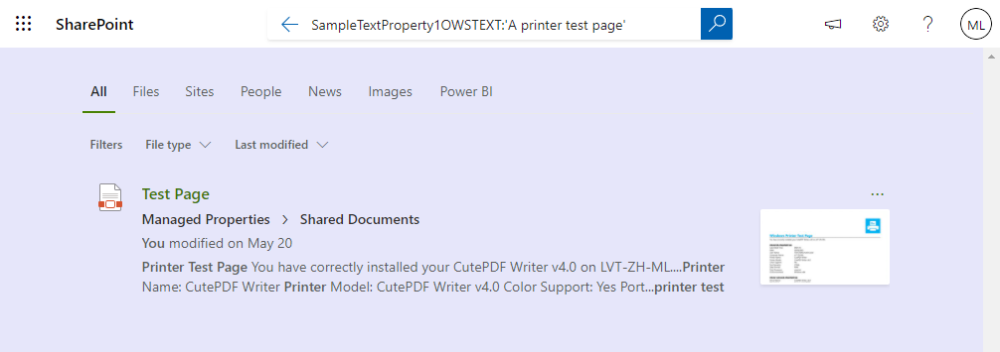
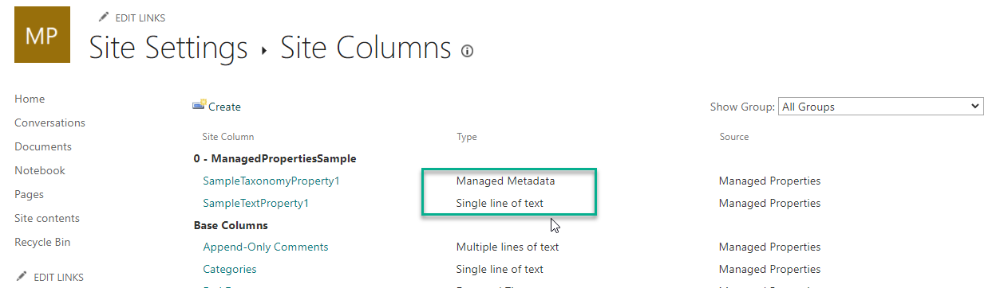
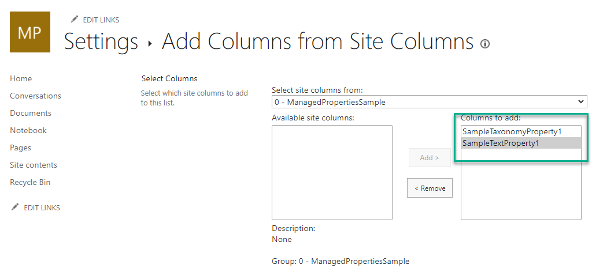
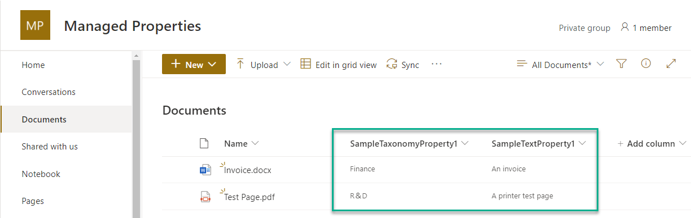
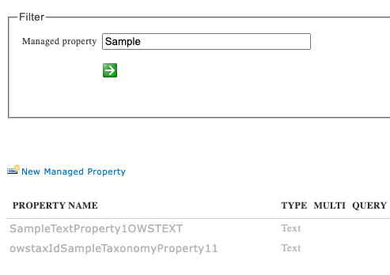
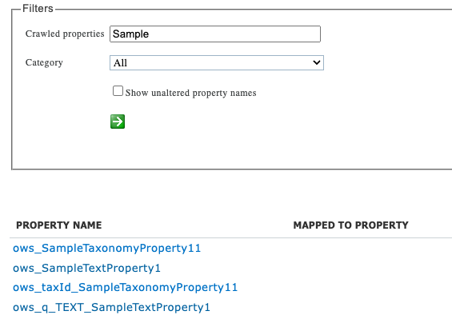
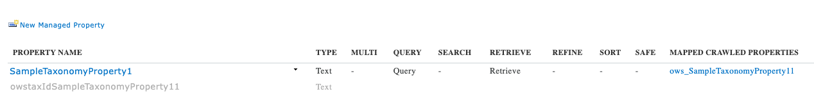
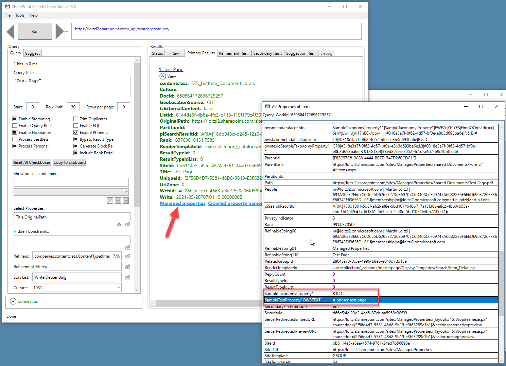
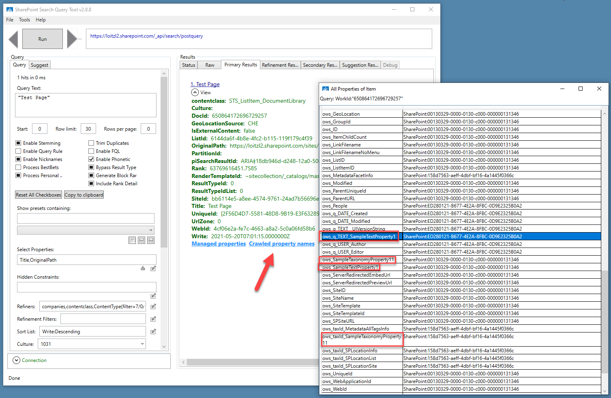

# Introduction

Lately I had the chance to troubleshoot an issue we had with SharePoint Online Search. This article summarizes what I have learned with a small example scenario.

First lets add some site columns

- one simple Text column `SampleTextProperty1`
- and a managed metadata column `SampleTaxonomyProperty1` to make it more intesting 



Then add the site columns to a document library:



Upload documents and set some metadata:



## Analyze Crawl Log

We can immediately check if the documents get crawled with the [`Get-PnPSearchCrawlLog`](https://pnp.github.io/powershell/cmdlets/Get-PnPSearchCrawlLog.html) PnP Powershell Commandlet, the `-Filter` parameter allows to filter by site url for example. 

```powershell
$ Connect-PnPOnline -Url https://loitzl2.sharepoint.com/sites/ManagedProperties/ -DeviceLogin
[...]

$ Get-PnPSearchCrawlLog `
   -Filter https://loitzl2.sharepoint.com/sites/ManagedProperties

[...]

Url             : https://loitzl2.sharepoint.com/sites/ManagedProperties/Shared Documents/Test Page.pdf
CrawlTime       : 10/12/2021 6:22:25 AM
ItemTime        : 10/12/2021 1:22:10 PM
LogLevel        : Success
Status          :
ItemId          : 58807014
ContentSourceId : 1

Url             : https://loitzl2.sharepoint.com/sites/ManagedProperties/Shared Documents/Invoice.docx
CrawlTime       : 10/12/2021 6:22:24 AM
ItemTime        : 10/12/2021 1:21:54 PM
LogLevel        : Success
Status          :
ItemId          : 58807017
ContentSourceId : 1

[..]
```

✅ Seems to be OK

The permissions for reading the search crawl log can be set in the SharePoint Admin Center:

`/_layouts/15/searchadmin/crawllogreadpermission.aspx`

## Re-crawl a Document Library

In case we need to tell the search crawler to crawl the document library again the [`Request-PnPReIndexList`](https://pnp.github.io/powershell/cmdlets/Request-PnPReIndexList.html?q=Request-PnPReIndexList) pnp powershell commandlet can be used:

```powershell
$ Request-PnPReIndexList -Identity "Documents"
```

The same function is surfaced in the UI:

[https://docs.microsoft.com/en-us/sharepoint/crawl-site-content](https://docs.microsoft.com/en-us/sharepoint/crawl-site-content#re-index-a-document-library-or-a-list)

🤓 What happens behind the scenes ist, that the `vti_searchversion` property bag value gets increased:

```cs
const string reIndexKey = "vti_searchversion";
var searchversion = 0;

if (list.PropertyBagContainsKey(reIndexKey))
{
  searchversion = (int)list.GetPropertyBagValueInt(reIndexKey, 0);
}
try
{
  list.SetPropertyBagValue(reIndexKey, searchversion + 1);
}
[...]
```

see [Microsoft.SharePoint.Client.ListExtensions](https://github.com/pnp/pnpframework/blob/770d9bd03873358565773faa025f456d4a3a35fe/src/lib/PnP.Framework/Extensions/ListExtensions.cs#L2248)

And, btw, the same works for whole sites with the [`Request-PnPReIndexWeb`](https://pnp.github.io/powershell/cmdlets/Request-PnPReIndexWeb.html) commandlet which writes `vti_searchversion` to the `SP.Web` property bag.

see [Microsoft.SharePoint.Client.WebExtensions](https://github.com/pnp/pnpframework/blob/770d9bd03873358565773faa025f456d4a3a35fe/src/lib/PnP.Framework/Extensions/WebExtensions.cs#L1003)

<hr></hr>

# Managed Properties

After giving the search crawler some time, two new managed properties will probably show up:



Using the [`Submit-PnPSearchQuery`](https://pnp.github.io/powershell/cmdlets/Submit-PnPSearchQuery.html) search results can be retrieved:

```powershell
$ Submit-PnPSearchQuery ` 
     -Query "SampleTextProperty1OWSTEXT:'An Invoice'" 

GroupTemplateId              : 
ItemTemplateId               : 
Properties                   : {[RenderTemplateId, ~sitecollection/_catalogs/masterpage/Display Templates/Sea
                               rch/Group_Default.js], [QueryModification, SampleTextProperty1OWSTEXT:'An Invo
                               ice' -ContentClass=urn:content-class:SPSPeople], [ExecutionTimeMs, 0], [StartR
                               ecord, 0]…}
QueryId                      : 0fc5abbe-875a-2e7c-32dc-e49b00dcfb21
QueryRuleId                  : 00000000-0000-0000-0000-000000000000
ResultRows                   : {System.Collections.Generic.Dictionary`2[System.String,System.Object]}
ResultTitle                  : 
ResultTitleUrl               : 
RowCount                     : 1
TableType                    : RelevantResults
TotalRows                    : 1
TotalRowsIncludingDuplicates : 1
TypeId                       : {6780df59-1036-4912-829b-432354f22656}
```

We receive exactly the one item in the document library.

```powershell
$ (Submit-PnPSearchQuery `
  -Query "SampleTextProperty1OWSTEXT:'An Invoice'") `
     .ResultRows `
       .OriginalPath

https://.../ManagedProperties/Shared Documents/Invoice.docx

```

We can also retrieve the value of the Managed Property `SampleTextProperty1OWSTEXT`:

```powershell
$ (Submit-PnPSearchQuery `
  -Query "SampleTextProperty1OWSTEXT:'A printer test page'" `
  -SelectProperties SampleTextProperty1OWSTEXT) `
     .ResultRows `
        .SampleTextProperty1OWSTEXT

A printer test page
```

One problem that arises here that the other managed property `owstaxIdSampleTaxonomyProperty11` contains the ids of the taxonomy tree.

```powershell
$ (Submit-PnPSearchQuery `
     -Query "SampleTextProperty1OWSTEXT:'A printer test page'" `
     -SelectProperties owstaxIdSampleTaxonomyProperty11) `
        .ResultRows `
           .owstaxIdSampleTaxonomyProperty11        

GP0|#318e3a7f-0f62-4d57-bf0e-e8b3d693ba6e;L0|#0318e3a7f-0f62-4d57-bf0e-e8b3d693ba6e|R＆D;GTSet|#8ed8c9ea-7052-4c1d-a4d7-b9c10bffea6f

```

Search also creates a crawled property containing the label of a taxonomy field:



So lets create a new managed property named `SampleTaxonomyProperty1` and map the crawled property `ows_SampleTaxonomyProperty11` to it:



And retrieve it:

```powershell
$ (Submit-PnPSearchQuery ``
   -Query "SampleTextProperty1OWSTEXT:'A printer test page'" `
   -SelectProperties SampleTaxonomyProperty1) `
     .ResultRows `
       .SampleTaxonomyProperty1

R& D
```

Thats a lot more readable ✌️

> <b>Note:</b> Might take a couple of minutes after mapping for the value to show up.

<hr></hr>

# Search Query Tool

Another nice tool is the [SharePoint Search Query Tool](https://github.com/pnp/PnP-Tools/tree/master/Solutions/SharePoint.Search.QueryTool) which has been archived in the PnP github repo.
It allows doing the same things as with [`Submit-PnPSearchQuery`](https://pnp.github.io/powershell/cmdlets/Submit-PnPSearchQuery.html), especially getting all managed properties can be helpful:



There is also a possibility to retrieve (at least the names of) all crawled properties of the item:





# Conclusion

Working with Search in SharePoint Online with a SharePoint on-prem background feels odd at the beginning since its easy to just access the ULS Logs.

Actually there are a plenty of possbilities around to analyze Managed Properties, Crawled Properties and the Crawl Log itself.

I will update that article if I find some new tricks.

> 💙