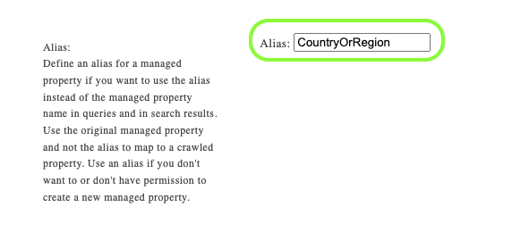
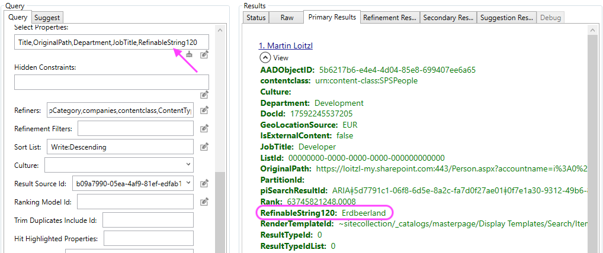

Azure Active Directory

SharePoint User Profile


<p>&nbsp;</p>
<p style="text-align: center;"><font size="7">🍓</font></p>

# Introduction

In SharePoint Online only syncs a [predefined set of properties](https://docs.microsoft.com/en-us/sharepoint/user-profile-sync) from an Azure Active Directory User object to the SharePoint UserProfile and as mentioned in the [FAQ]((https://docs.microsoft.com/en-us/sharepoint/user-profile-sync#frequentlyasked-questions-faqs)) section **no** additional properties can be added.

But it is still possible to add new [User Profile Properties](https://docs.microsoft.com/en-us/sharepoint/add-and-edit-user-profile-properties) in SharePoint Online.

The newly created property becomes a Crawled Property and can be mapped to a Managed Property and surfaced in the [SharePoint Online Search Schema](https://docs.microsoft.com/en-us/sharepoint/manage-search-schema).

Using a timer-triggered Azure Function it is possible to synchronize Azure Active Directory properties of a user object (or anything else) with the SharePoint Online User Profile.

This example shows how to get the 'Country or Region' property of the AAD User object synced with a SharePoint User Profile custom property and a Managed Property in SharePoint Online Search.

# Creating the User Profile Property

- Navigate to SharePoint Admin Center -> More Features -> User Profiles
```sh 
https://<tenant>-admin.sharepoint.com/
      _layouts/15/TenantProfileAdmin/
           ManageUserProfileServiceApplication.aspx
```
- Click "Manage User Properties"
- Add a "New Property"
- Give it a name
- Be sure that the "Default Privacy Setting" is set to "Everyone"


- Be sure that in "Search Settings" the checkbox "Indexed" is set


# Creating the Search Managed Property

- Navigate to SharePoint Admin Center -> More Features -> Search
- Click "Manage Search Schema"
- Select "Managed Properties"

```sh 
https://<tenant>-admin.sharepoint.com/
       _layouts/15/searchadmin/
           ta_listmanagedproperties.aspx?level=tenant
```
- Look for an existing "RefineableStringXYZ" (I used "RefinableString120" in this example)
- Add an Alias, e.g., CountryOrRegion



- Click "Add a Mapping" to map the Crawled Property "People:CustomCountry" on the "Managed Property"


**Note**: It may take several hours for the Crawled Property "People:CustomCountry" to show up.

# Setup Authentication for the Azure Function

This topic is addressed in another article [Creating SharePoint Terms using the App Context with the new PnP Core SDK](/posts/creating-sharePoint-managed-metadata-terms-using-the-new-pnp-core-sdk/#setup-authentication).

A PowerShell Script can be found in the [Github Repository](https://github.com/mloitzl/azurefunctionsprofilesync/blob/main/Configure.ps1).


# The Azure Function

The Azure Function implementation that synchronizes the "Country or Region" property can be found in this [GitHub Repository](https://github.com/mloitzl/azurefunctionsprofilesync/blob/cf6bedb974a90ef5b824c33481f183b801b110bb/SyncCountry.cs#L32)


[`Utility.ResolvePrincipal`](https://docs.microsoft.com/en-us/previous-versions/office/sharepoint-csom/ee540627(v=office.15)) can be used to receive the [login of the user](https://github.com/mloitzl/azurefunctionsprofilesync/blob/cf6bedb974a90ef5b824c33481f183b801b110bb/SyncCountry.cs#L80)

```cs
var resolvedPrincipal =
  Utility.ResolvePrincipal(
      clientContext,
      clientContext.Web,
      user.Mail,
      PrincipalType.User,
      PrincipalSource.All,
      null,
      true); // true - as input is only the email

await clientContext.ExecuteQueryRetryAsync();
PrincipalInfo principal = resolvedPrincipal.Value;

string loginName = principal.LoginName;
```

With the `loginName` we can then [update](https://github.com/mloitzl/azurefunctionsprofilesync/blob/cf6bedb974a90ef5b824c33481f183b801b110bb/SyncCountry.cs#L99) the `CustomCountry` property.

```cs
  var peopleManager = new PeopleManager(clientContext);
  peopleManager.SetSingleValueProfileProperty(
      loginName,
      "CustomCountry",  // The custom UserProfile property
      user.Country);
  clientContext.Load(peopleManager);
  await clientContext.ExecuteQueryRetryAsync();
```

# The Problem

[`PeopleManager`](https://docs.microsoft.com/en-us/previous-versions/office/sharepoint-csom/jj163361(v=office.15)) can be used to manage SharePoint Online UserProfile Properties.

The Azure AD app registration that is used for [accessing the graph](https://github.com/mloitzl/azurefunctionsprofilesync/blob/cf6bedb974a90ef5b824c33481f183b801b110bb/SyncCountry.cs#L39) **cannot** be used to access the SharePoint User Profile.

Since we are authenticating the Azure Function using the [PnP Core SDK](https://pnp.github.io/pnpcore/api/PnP.Core.Auth.X509CertificateAuthenticationProvider.html) we can use [PnP.Framework.AuthenticationManager.GetACSAppOnlyContext](https://docs.microsoft.com/en-us/answers/questions/341294/how-to-perform-sharepoint-online-authentication-in.html) to get a [`ClientContext`](https://docs.microsoft.com/en-us/previous-versions/office/sharepoint-csom/ee538685(v=office.15)).

```cs
  public ClientContext GetACSAppOnlyContext(
    string siteUrl, string appId, string appSecret)
```

The `appId` and `appSecret` required for this call are from a SharePoint Add-In Registration.

So, a "proxy" SharePoint Add-In is required for that:

Let's first create a new Add-In using `AppRegNew.aspx`:

```sh
    https://<tenant>.sharepoint.com
          /_layouts/15/appregnew.aspx
```

- Generate Client Id - note the id for later use
- Generate Client Secret - note the secret for later use
- Title: 'Graph SyncJob Delegate App'
- App Domain: "www.localhost.com"
- Redirect URL: "https://www.localhost.com"

Then the permissions need to be assigned using:
```sh
  https://<tenant>-admin.sharepoint.com
           /_layouts/15/appinv.aspx
```

- Enter the App Id from the previous step and click on 'Lookup'.
- In the Add-Ins's permissions request, enter the followings:
    
```xml
<AppPermissionRequests AllowAppOnlyPolicy="true">
    <AppPermissionRequest Scope="http://sharepoint/social/tenant" Right="FullControl" />
</AppPermissionRequests>
 ```
- Click on "Create"
- Click on "Trust"

This will request App Only Permissions for writing to the SharePoint User Profile.

# Enabling App Only Authentication

App-Only authentication is deactivated by default, but it can be enabled with this [PnP PowerShell](https://pnp.github.io/powershell/cmdlets/Set-PnPTenant.html) command:

```ps
    Connect-PnPOnline -Url https://<tenant>-admin.sharepoint.com -DeviceLogin
    Set-PnPTenant -DisableCustomAppAuthentication $false
```

# Results

After the job ran successfully the UserProfile contains a value from the Azure AD field "Country or Region" on the SharePoint UserProfile...

SharePoint User Profile


... and in Search, we have the `RefinableString120` property with the same value.

```powershell
(Submit-PnPSearchQuery `
  -SourceId b09a7990-05ea-4af9-81ef-edfab16c4e31       # User Profiles              `
  -Query "DocId:17592245537205"                        # My Account in this Tenant  `
  -SelectProperties RefinableString120,CountryOrRegion # mapped to CustomCountry    `
).ResultRows
```

```sh
Key                      Value
---                      -----
RefinableString120       Erdbeerland
CountryOrRegion          Erdbeerland
DocId                    17592245537205
GeoLocationSource        EUR
contentclass             urn:content-class:SPSPeople
AccountName              i:0#.f|membership|martin@loitzl.onmicrosoft.com
Department               Development
JobTitle                 Developer
LastModifiedTime         03/17/2022 09:54:21
Path                     https://loitzl-my.sharepoint.com/Person.aspx?accountname=i:0%23.f|membership|martin@loitzl.onmicrosoft.com
PictureURL               https://loitzl-my.sharepoint.com/User Photos/Profile Pictures/martin_loitzl_onmicrosoft_com_MThumb.jpg
PreferredName            Martin Loitzl
SipAddress               martin@loitzl.onmicrosoft.com
WorkEmail                martin@loitzl.com
Title                    Martin Loitzl
```




# Final Notes

- The function uses PnP.Core Authentication to connect to MS Graph and a SharePoint "Proxy" Add-In with AppOnly Permissions to write to the SharePoint User Profile Service:


- And Kudos to [Darius](https://dariuspintilie.eu/) for figuring that out in one of our customer projects 👍🦄