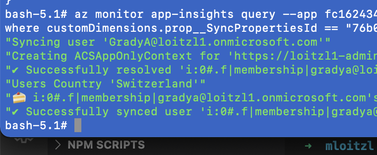

# Objective

Besides the Azure Insights user interface in the Azure Portal before there is also an Azure CLI extension for retrieving and querying Azure Insights data.

This article describes a way how to retrieve that data in a background job or daemon application.


# Authentication Options

There are several ways to authenticate the Azure CLI using `az login`.

## Interactive Login

If the login request is from a computer with a browser, a login window will automatically pop-up.

When the cli is running in a container or remote ssh session Azure CLI will automatically fall back to device authentication:

```shell
$ docker run -v ${PWD}:/workspace -it mcr.microsoft.com/azure-cli

[Container starts]

bash-5.1# az login
To sign in, use a web browser to open the page https://microsoft.com/devicelogin and enter the code AABBCCDD5 to authenticate.

[Sign In in Browser]

[
  {
    "cloudName": "AzureCloud",
    [..]
    "name": "Visual Studio Ultimate mit MSDN",
    "state": "Enabled",
    "tenantId": "0a7ab993-afa3-4a29-9b0b-f64583a4d888",
    [..]
  }
]

bash-5.1# 
```

## Automated Login

For automation purposes it can be necessary to authenticate within azure cli using a client secret...

```bash
$ az login \
  --service-principal -u c4fe6c64-4e6a-4997-9a4f-7d96b30dfb51 \ # App Id
  -p iNr....GaaNE \ # Client Secret
  --tenant 0a7ab993-afa3-4a29-9b0b-f64583a4d888 # Tenant id or name
```

...or with a client certificate in pem format:

```bash
$ az login \
  --service-principal -u c4fe6c64-4e6a-4997-9a4f-7d96b30dfb51 \ # App Id
  -p ClientCert.pem \ # Client Certificate
  --tenant 0a7ab993-afa3-4a29-9b0b-f64583a4d888 # Tenant id or name
```

Information on how to obtain a certificate in pem format using `openssl` can be found [here](/posts/creating-sharePoint-managed-metadata-terms-using-the-new-pnp-core-sdk/#setup-authentication)

# Find the Azure Insights Resource

Now we can try to find the correct azure insights resource.

With `az group list` resource groups where the service principal has access can be listed.

```bash
$ az group list 
{ [..] },
{
    "id": "/subscriptions/4664bbed-abef-4e8b-bd4a-462f757c712c/resourceGroups/rg-dev",
    "location": "switzerlandnorth",
    "managedBy": null,
    "name": "dev",
    "properties": {
      "provisioningState": "Succeeded"
    },
    "tags": null,
    "type": "Microsoft.Resources/resourceGroups"
}
{ [..] },
{ [..] }
```

When the resource group name is known we can list the contents of a resource group using `az resource list`

```bash
$ az resource list \
  --resource-group rg-dev \ # the resource group from the previous step
  --resource-type Microsoft.Insights/components # azure insights type

[
  {
    "changedTime": "2022-02-24T10:17:15.282736+00:00",
    "createdTime": "2022-02-24T10:07:14.668422+00:00",
    "extendedLocation": null,
    "id": "/subscriptions/4664bbed-abef-4e8b-bd4a-462f757c712c/resourceGroups/rg-dev/providers/Microsoft.Insights/components/dev",
    "identity": null,
    "kind": "web",
    "location": "switzerlandnorth",
    "managedBy": null,
    "name": "dev",
    "plan": null,
    "properties": null,
    "provisioningState": "Succeeded",
    "resourceGroup": "rg-dev",
    "sku": null,
    "tags": {},
    "type": "Microsoft.Insights/components"
  }
]
```

The value of the `id` can be used to retrieve monitoring events.

# Retrieving Events

Using `az monitor app-insights events` we can now retrieve events from Azure Insights by passing the `id` retrieved in the previous step as the `--app` parameter.

```bash
$ az monitor app-insights events show \
  --app /subscriptions/4664bbed-abef-4e8b-bd4a-462f757c712c/resourceGroups/rg-dev/providers/Microsoft.Insights/components/dev \
  --type traces \
  --offset 24h
```

Setting the `--offset` parameter will retrieve application traces within the last 24 hours.

```js
{[..]},
{
      "ai": {
        "appName": "dev",
        "sdkVersion": "azurefunctions: 3.5.2.0",
        [..]
      },
      "application": {[..]},
      "client": {
        [..],
        "type": "PC"
      },
      "cloud": {
        "roleInstance": "...",
        "roleName": "dev"
      },
      "count": 1,
      "customDimensions": { [..] },
      "customMeasurements": null,
      "id": "dbf73851-ba43-11ec-a27c-af008d3d954f",
      "operation": {
        "name": "PeopleSyncJob",
        "parentId": "2bd1380092e0fd47",
        [..]
      },
      "session": {
        "id": ""
      },
      "timestamp": "2022-04-12T09:35:02.767000+00:00",
      "trace": {
        "message": "🍰 i:0#.f|membership|gradya@loitzl1.onmicrosoft.com's Birthday: '3/8/2000 12:00:00 AM'",
        "severityLevel": 0
      },
      "type": "trace",
      "user": {[..]}
    }
{[..]},
{[..]}
```

The field `trace.message` contains the custom log entry we might be interested in.


# Executing Analytics Queries

It is also possible to run [kusto queries](https://docs.microsoft.com/en-us/azure/data-explorer/kusto/query/) within Azure CLI using `az monitor app-insights query`

```bash
$ az monitor app-insights query \
  --app fc162434-7ef9-4d1c-a9d7-3ac820c38800 \
  --offset 24h \
  --analytics-query 'traces | search "*grady*"'
```

This returns a json table structure

```json
{
  "tables": [
    {
      "columns": [..],
      "name": "PrimaryResult",
      "rows": [..]
    }
  ]
}
```

where `columns` contains a description of the row's data,

```json
{
 "columns": [
   {
     "name": "$table",
     "type": "string"
   },
   {
     "name": "timestamp",
     "type": "datetime"
   },
   {
     "name": "message",
     "type": "string"
   },
   [...]
```
and `rows` contains the actual data:


```json
 [
   "traces",
   "2022-04-11T16:00:02.770299Z",
   "🍰 i:0#.f|membership|gradya@loitzl1.onmicrosoft.com's Birthday: '3/8/2000 12:00:00 AM'",
   [..]
```

## Correlate Log entries

If we have something that can be used to correlate log entries over one request or operation, a full trace can be retrieved like this:

```bash
$ az monitor app-insights query \
  --app fc162434-7ef9-4d1c-a9d7-3ac820c38800 \
  --offset 24h \
  --analytics-query 'traces | where customDimensions.prop__SyncPropertiesId == "76b036f3-3083-4472-8958-171c46fb8e02"'
```

together with the magic of [`jq`](https://stedolan.github.io/jq/) we can transform the result into a complete trace of a certain operation:
```bash
 $ ... | jq '.tables[0] | .rows | .[][1]'
 ```


 ```text
 "Syncing user 'GradyA@loitzl1.onmicrosoft.com'"
 "Creating ACSAppOnlyContext for 'https://loitzl1-admin.sharepoint.com' and 'eca24dc1-1e18-4ed0-94b7-f9c269caf540'"
 "✔ Successfully resolved 'i:0#.f|membership|gradya@loitzl1.onmicrosoft.com'"
 "Users Country 'Switzerland'"
 "🍰 i:0#.f|membership|gradya@loitzl1.onmicrosoft.com's Birthday: '3/8/2000 12:00:00 AM'"
 "✔ Successfully synced user 'i:0#.f|membership|gradya@loitzl1.onmicrosoft.com'"
 ```

# Outlook

Being able to retrieve and analyze Azure Insights data as a daemon app brings interesting opportunities for log analytics and alerting.

It could also be used for higher level integration testing in projects with a low level of testability.