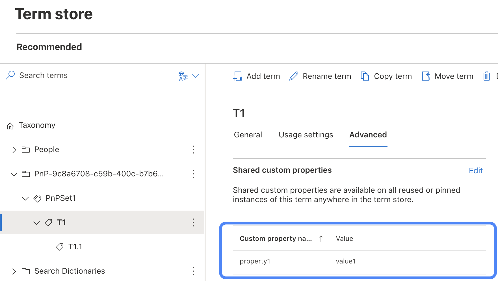

# Objective

A nice feature of SharePoint Managed Metadata is the possibility to store custom key-value pairs as "Shared custom properties" on terms.




Using the [PnP Core SDK](https://pnp.github.io/pnpcore/) they are also easy to add programatically:

```cs
// Add a term set
var termSet = await group
    .Sets
    .AddAsync("PnPSet1", "Set description");

// Add a term
var newTerm = await termSet
    .Terms
    .AddAsync("T1", "Description in English");

// Add a custom property with key and value
newTerm.AddProperty(
    "property1", 
    "value1"
);

// Commit changes
await newTerm.UpdateAsync();
```

I used this feature a lot to create hierarchical structures, e.g. for tree like site collection navigation.
Each site collection url is stored as a custom property on the corresponding term.

Simple as that.

The concept is so generic that it opens up a lot of other possibilities, e.g. the key-value pairs do not have to be unique, so it can also be used for categories or classification, etc.

# Retrieving Terms using custom properties


A new feature of the [PnP Core SDK](https://pnp.github.io/pnpcore/) comes with [PnP Core SDK v1.8](https://pnp.github.io/blog/pnp-core-sdk/pnp-core-sdk-v1-8/):

> Add ITermSet.GetTermsByCustomProperty method to retrieve a list of terms with a certain custom property key and value

The new method [`ITermSet.GetTermsByCustomProperty( key, value )`](https://pnp.github.io/pnpcore/api/PnP.Core.Model.SharePoint.ITermSet.html#PnP_Core_Model_SharePoint_ITermSet_GetTermsByCustomProperty_System_String_System_String_System_Boolean_) gets a list of all `ITerm`s containing a certain custom property key and value.

```cs
// load the terms by custom property
var IList<ITerm> = await termSet
    .GetTermsByCustomProperty(
        "property1", 
        "value1"
     );
```

There is a section in [Working with taxonomy: advanced concepts](https://pnp.github.io/pnpcore/using-the-sdk/taxonomy-advanced.html#getting-terms-based-upon-their-property-values) giving a little bit of context around that topic.


Slick 💪


---
Photo in Metadata by [Ave Calvar Martinez](https://www.pexels.com/photo/brown-cow-3640073/)