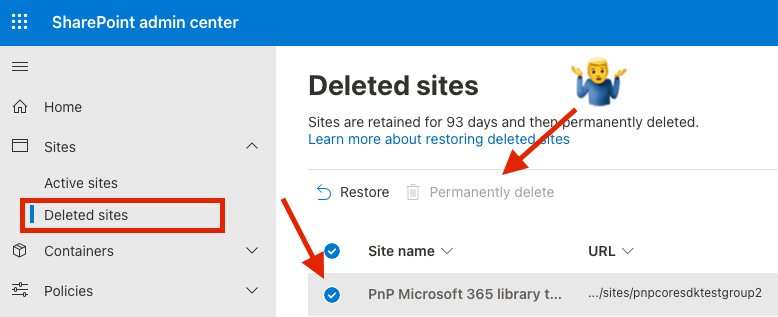
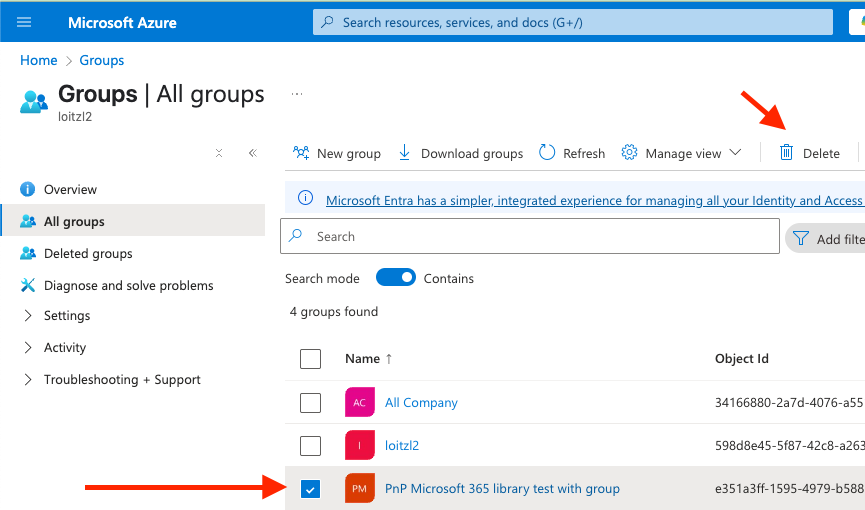
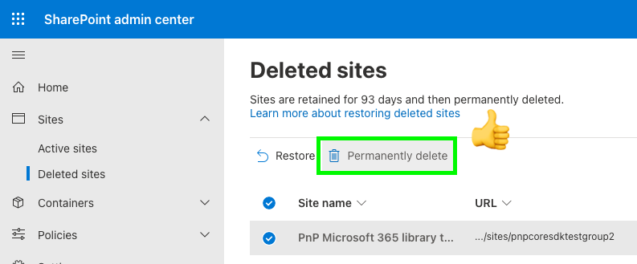

When a SharePoint Online site was deleted, it might have been connected to a M365 group. In this case it cannot be removed from deleted sites.



First delete the group from Entra (Azure AD)




Using PnP Powershell command `Get-PnPDeletedMicrosoft365Group` it is possible to find the deleted M365 Group, and remove it with `Remove-PnPDeletedMicrosoft365Group`:

```powershell

PS /Users/martin> Get-PnPDeletedMicrosoft365Group

DisplayName                               Id                                   HasTeam SiteUrl
-----------                               --                                   ------- -------
PnP Microsoft 365 library test with group e351a3ff-1595-4979-b588-88038f993cc6 False

Remove-PnPDeletedMicrosoft365Group -Identity e351a3ff-1595-4979-b588-88038f993cc6

```

> Afterwards the  permanetly delete button works:




Bonus Feature: Since we are already connected, we can also use `Get-PnPTenantDeletedSite` and `Remove-PnPTenantDeletedSite` to remove the site permanently.

```powershell

PS /Users/martin> Get-PnPTenantDeletedSite

SiteId                 : b0d12530-9a8d-4173-874b-eb8001090fdf
Url                    : https://loitzl2.sharepoint.com/sites/pnpcoresdktestgroup2
Status                 : Recycled
DeletionTime           : 10.04.2025 18:37:19
DaysRemaining          : 92
StorageQuota           : 26214400
ResourceQuota          : 300

PS /Users/martin> Remove-PnPTenantDeletedSite -Force https://loitzl2.sharepoint.com/sites/pnpcoresdktestgroup
```

